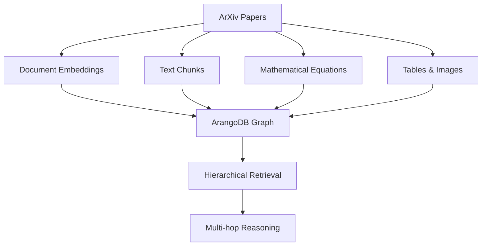

# HADES - Heterogeneous Adaptive Dimensional Embedding System

Production infrastructure for Information Reconstructionism - processing, storing, and serving embedded knowledge through ArangoDB with PostgreSQL metadata management.

## Overview

HADES is a distributed network infrastructure following Actor-Network Theory principles:

- **ArangoDB Graph Store**: Primary storage for embeddings and document structures
- **PostgreSQL Database**: Complete ArXiv metadata management (2.7M+ papers)
- **Jina v4 Embeddings**: 2048-dimensional with late chunking (32k token context)
- **Direct PDF Processing**: Processes papers directly from `/bulk-store/arxiv-data/pdf/`
- **ACID Compliance**: Atomic transactions ensure data consistency
- **Acheron Protocol**: Deprecated code preservation with timestamps (never delete, always preserve)

## Architecture

```dir
HADES-Lab/
├── core/                       # Core HADES infrastructure
│   ├── mcp_server/            # MCP interface for Claude integration
│   ├── framework/             # Shared framework
│   │   ├── embedders.py      # Jina v4 embeddings
│   │   ├── extractors/       # Content extraction
│   │   │   ├── docling_extractor.py    # PDF extraction
│   │   │   ├── code_extractor.py       # Code file extraction
│   │   │   └── tree_sitter_extractor.py # Symbol extraction
│   │   └── storage.py        # ArangoDB management
│   ├── processors/            # Base processor classes
│   ├── utils/                 # Core utilities
│   └── logs/                  # Core system logs
│
├── tools/                      # Processing tools (data sources)
│   ├── arxiv/                 # ArXiv paper processing
│   │   ├── pipelines/         # ACID-compliant pipelines
│   │   ├── monitoring/        # Real-time monitoring
│   │   ├── database/          # Database utilities
│   │   ├── scripts/           # Utility scripts
│   │   ├── utils/             # Database utilities
│   │   ├── tests/             # Integration tests
│   │   ├── configs/           # Pipeline configurations
│   │   └── logs/              # ArXiv processing logs
│   ├── github/                # GitHub repository processing
│   │   ├── configs/           # GitHub pipeline configurations
│   │   ├── github_pipeline_manager.py  # Graph-based processing
│   │   ├── setup_github_graph.py       # Graph collection setup
│   │   └── test_treesitter_simple.py   # Tree-sitter testing
│   └── hirag/                 # HiRAG hierarchical retrieval system
│       ├── configs/           # HiRAG pipeline configurations
│       ├── hirag_pipeline.py  # HiRAG processing pipeline
│       └── hierarchical_retrieval.py   # Multi-level retrieval engine
│
├── experiments/                # Research and experimentation
│   ├── README.md              # Experiment guidelines
│   ├── experiment_template/   # Template for new experiments
│   ├── datasets/              # Shared experimental datasets
│   │   ├── cs_papers.json     # Computer Science papers
│   │   ├── graph_papers.json  # Graph theory papers
│   │   ├── ml_ai_papers.json  # ML/AI papers
│   │   └── sample_10k.json    # Quick testing sample
│   ├── documentation/         # Experiment-specific analysis
│   │   └── experiments/       # Research notes and findings
│   └── experiment_1/          # Individual experiments
│       ├── config/            # Experiment configurations
│       ├── src/               # Experiment source code
│       └── analysis/          # Results and analysis
│
├── docs/                       # System documentation
│   ├── adr/                   # Architecture Decision Records
│   ├── agents/                # Agent configurations
│   ├── theory/                # Theoretical framework
│   └── methodology/           # Implementation methodology
│
└── .claude/                    # Claude Code configurations
    └── agents/                # Custom agent definitions
```

## Features

### Current (Production Ready)

- **ACID Pipeline**: 11.3 papers/minute with 100% success rate (validated on 1000+ papers)
- **Phase-Separated Architecture**: Extract (GPU-accelerated Docling) → Embed (Jina v4)
- **Direct PDF Processing**: No database dependencies, processes from local filesystem
- **GitHub Repository Processing**: Clone, extract, embed code with Tree-sitter symbol extraction
- **Graph-Based Storage**: Repository → File → Chunk → Embedding relationships in ArangoDB
- **Tree-sitter Integration**: Symbol extraction for Python, JavaScript, TypeScript, Java, C/C++, Go, Rust
- **Jina v4 Late Chunking**: Context-aware embeddings preserving document structure (32k tokens)
- **Multi-collection Storage**: Separate ArangoDB collections for embeddings, equations, tables, images
- **PostgreSQL Metadata Store**: Complete ArXiv dataset with 2.7M+ papers and metadata
- **Experiments Framework**: Structured research environment with curated datasets
- **HiRAG Integration**:  [Hierarchical Knowledge RAG](https://arxiv.org/abs/2503.10150)

### In Development

- **Cross-Repository Analysis**: Theory-practice bridge detection across repositories
- **Enhanced Config Understanding**: Leveraging Jina v4's coding LoRA for config semantics
- **Incremental Repository Updates**: Only process changed files
- **Active Monitoring**: Real-time pipeline monitoring system

## Installation

```bash
# Clone the repository
git clone git@github.com:r3d91ll/HADES-Lab.git
cd HADES-Lab

# Install dependencies with Poetry
poetry install
# Optional: activate the virtual environment
# poetry shell

# Configure database connections
export ARANGO_PASSWORD="your-arango-password"
export ARANGO_HOST="192.168.1.69"  # or your host
export PGPASSWORD="your-postgres-password"

# GPU settings (optional)
export CUDA_VISIBLE_DEVICES=1  # or 0,1 for dual GPU
```

## ArXiv Dataset Creation Process

HADES uses a comprehensive ArXiv dataset built from multiple sources. **This is a one-time setup process** that creates the foundation for all ArXiv research.

### Data Sources

1. **Metadata** (Required): [Kaggle ArXiv Dataset](https://www.kaggle.com/datasets/Cornell-University/arxiv)
   - Complete metadata for ~2.7M papers (2007-2025)
   - Authors, categories, abstracts, submission dates, versions
   - Free download with Kaggle account

2. **PDF Files** (Recommended): ArXiv S3 Bucket via AWS
   - Source: <https://info.arxiv.org/help/bulk_data_s3.html>
   - Location: `s3://arxiv/pdf/` (papers in PDF format)
   - **Cost Estimate**: ~$400-600 for complete download (~4TB)

3. **LaTeX Sources** (Optional): ArXiv S3 Bucket via AWS  
   - Source: `s3://arxiv/src/` (LaTeX source files)
   - **Cost Estimate**: ~$200-400 for complete download (~2TB)

### Step-by-Step Setup

#### 1. Download Metadata (Free)

```bash
# Download from Kaggle (requires account)
# https://www.kaggle.com/datasets/Cornell-University/arxiv
# Extract arxiv-metadata-oai-snapshot.json to:
mkdir -p /bulk-store/arxiv-data/metadata/
# Place file at: /bulk-store/arxiv-data/metadata/arxiv-metadata-oai-snapshot.json
```

#### 2. Download PDFs (AWS S3 - Costs Money)

> **⚠️ COST WARNING**  
> **This will charge you AWS egress fees (~$400-600 for ~4TB)**  
> • Requester Pays bucket - you pay all transfer costs  
> • Transfer may take hours/days depending on bandwidth  
> • Run with `--dryrun` first to estimate scope  
> • Consider downloading specific years only (see examples below)  
> • Requires us-east-1 region for optimal costs  
> • Verify AWS credentials and billing alerts before starting  

```bash
# Install AWS CLI and configure credentials
aws configure

# RECOMMENDED: Test with dry run first
aws s3 sync s3://arxiv/pdf/ /bulk-store/arxiv-data/pdf/ \
    --request-payer requester \
    --region us-east-1 \
    --dryrun

# Full sync (Requestor Pays - you pay egress costs)
# Estimated cost: $400-600 for ~4TB
aws s3 sync s3://arxiv/pdf/ /bulk-store/arxiv-data/pdf/ \
    --request-payer requester \
    --region us-east-1

# Optional: Download specific years only (cheaper)
# Example: Only recent papers (2020-2025)
aws s3 sync s3://arxiv/pdf/ /bulk-store/arxiv-data/pdf/ \
    --request-payer requester \
    --region us-east-1 \
    --exclude "*" \
    --include "20*" \
    --include "21*" \
    --include "22*" \
    --include "23*" \
    --include "24*" \
    --include "25*"
```

#### 3. Download LaTeX Sources (AWS S3 - Optional)

```bash
# Sync LaTeX source files
# Estimated cost: $200-400 for ~2TB
aws s3 sync s3://arxiv/src/ /bulk-store/arxiv-data/tars/latex_src/ \
    --request-payer requester \
    --region us-east-1

# Extract LaTeX files to expected location
cd tools/arxiv/scripts/
python extract_latex_archives.py  # Script processes .tar files
```

#### 4. Build PostgreSQL Database

```bash
# Run the complete database rebuild (includes all 3 phases)
cd tools/arxiv/scripts/
export PGPASSWORD="your-postgres-password"
python rebuild_postgresql_complete.py

# This script:
# 1. Imports 2.7M papers metadata from Kaggle JSON
# 2. Scans local PDFs and updates has_pdf/pdf_path flags  
# 3. Scans local LaTeX and updates has_latex/latex_path flags
# Duration: 45-90 minutes for complete dataset
```

#### 5. Verify Setup

```bash
# Check database status
cd tools/arxiv/utils/
python check_db_status.py --detailed

# Expected results:
# - PostgreSQL: ~2.7M papers with complete metadata
# - Local PDFs: ~1.8M papers (if downloaded)
# - Local LaTeX: ~800K papers (if downloaded)
```

### Cost Breakdown (AWS S3)

| Component | Size | Estimated Cost | Required |
|-----------|------|----------------|----------|
| Metadata (Kaggle) | 4.5GB | Free | ✅ Required |
| PDF files | ~4TB | $400-600 | 🔄 Recommended |
| LaTeX sources | ~2TB | $200-400 | 🔄 Optional |
| **Total** | ~6TB | **$600-1000** | - |

**Cost Notes:**

- AWS charges requestor-pays egress fees
- Costs vary by region and transfer rates
- Consider downloading only recent years to reduce costs
- One-time setup cost for multi-year research value

### Alternative: Sample Datasets

For development and testing, use pre-built sample datasets:

```bash
# Use curated experiment datasets (no AWS costs)
ls experiments/datasets/
# - cs_papers.json (10K Computer Science papers)
# - graph_papers.json (5K Graph theory papers) 
# - ml_ai_papers.json (15K ML/AI papers)
# - sample_10k.json (Random 10K papers)
```

## HiRAG Integration

HADES implements HiRAG (Hierarchical Retrieval-Augmented Generation) as described in **["HiRAG: Retrieval-Augmented Generation with Hierarchical Knowledge"](https://arxiv.org/abs/2503.10150)**.

### Architecture Overview

HiRAG enhances traditional RAG by organizing knowledge hierarchically across three levels:

1. **Document Level**: Complete paper embeddings and metadata
2. **Chunk Level**: Text segments with preserved context (late chunking)  
3. **Entity Level**: Extracted concepts, equations, and structural elements

### ArangoDB Integration



### Key Features

- **Graph-Native Storage**: ArangoDB collections with hierarchical relationships
- **Entity Extraction**: Mathematical equations, tables, figures stored separately
- **Cross-Document Connections**: Theory-practice bridges between papers and code
- **Multi-Modal Support**: Text, equations, images, and code in unified graph
- **Semantic Search**: Vector similarity at document and chunk levels

### Collections Structure

```python
# ArangoDB Collections for HiRAG
arxiv_papers        # Document-level metadata and embeddings
arxiv_chunks        # Text chunks with context preservation  
arxiv_equations     # LaTeX equations with rendering metadata
arxiv_tables        # Table content and structure
arxiv_images        # Image metadata and descriptions
arxiv_embeddings    # Jina v4 vectors (2048-dim) for all content types

# Edge Collections (Relationships)
paper_has_chunks    # Paper → Chunk relationships
chunk_has_equations # Chunk → Equation relationships  
paper_cites        # Citation networks
theory_practice     # Theory-practice bridge detection
```

### Query Examples

```javascript
// Multi-hop reasoning: Find papers that cite theory X and implement it in code
FOR paper IN arxiv_papers
    FILTER paper.categories LIKE "cs.%"
    FOR cite IN OUTBOUND paper paper_cites
        FILTER cite.title LIKE "%graph neural network%"
        FOR implementation IN OUTBOUND paper theory_practice
            FILTER implementation.type == "code_implementation"
            RETURN {paper: paper.title, theory: cite.title, code: implementation.repo}
```

### Processing Pipeline Integration

The ArXiv Lifecycle Manager automatically populates HiRAG collections:

```bash
# Process papers with HiRAG entity extraction
python lifecycle_cli.py process 2503.10150

# Batch processing with hierarchical extraction
python lifecycle_cli.py batch paper_list.txt --hirag-extraction
```

### Research Applications

1. **Multi-hop Question Answering**: "What neural network architectures are used in papers that cite attention mechanisms?"
2. **Theory-Practice Bridging**: Connect theoretical papers with implementation repositories
3. **Cross-Domain Knowledge Discovery**: Find relationships between fields via shared concepts
4. **Temporal Knowledge Evolution**: Track how concepts develop across paper versions

## Usage

### ACID Pipeline (Direct PDF Processing)

```bash
# Run the ACID-compliant pipeline (11.3 papers/minute)
cd tools/arxiv/pipelines/
python arxiv_pipeline.py \
    --config ../configs/acid_pipeline_phased.yaml \
    --count 100 \
    --arango-password "$ARANGO_PASSWORD"

# Monitor progress
tail -f tools/arxiv/logs/acid_phased.log
```

### GitHub Repository Processing

```bash
# Setup graph collections (first time only)
cd tools/github/
python setup_github_graph.py

# Process a single repository
python github_pipeline_manager.py --repo "owner/repo"

# Example: Process word2vec repository
python github_pipeline_manager.py --repo "dav/word2vec"

# Query processed repositories (in ArangoDB)
# Find all embeddings for a repository:
# FOR v, e, p IN 1..3 OUTBOUND 'github_repositories/owner_repo'
#   GRAPH 'github_graph'
#   FILTER IS_SAME_COLLECTION('github_embeddings', v)
#   RETURN v
```

### Creating Experiments

```bash
# Copy template
cp -r experiments/experiment_template experiments/my_experiment

# Update configuration
vim experiments/my_experiment/config/experiment_config.yaml

# Run experiment
cd experiments/my_experiment
python src/run_experiment.py --config config/experiment_config.yaml
```

### Check Status

```bash
# Database status
python tools/arxiv/utils/check_db_status.py --detailed

# Verify GPU availability
nvidia-smi
```

## Philosophy

Following Actor-Network Theory (ANT) principles:

- **HADES is the network**, not any single component
- **Local filesystem**: External actant providing PDF documents
- **ArangoDB**: Primary actant for graph-based knowledge storage
- **Power through translation**: HADES translates documents into embedded knowledge
- **Direct processing**: No intermediate databases, straight from PDF to embeddings
- **Acheron Protocol**: "Code never dies, it flows to Acheron" - preserving development archaeology

## Import Conventions

```python
# From tools (e.g., in tools/arxiv/)
from core.framework.embedders import JinaV4Embedder
from core.framework.extractors import DoclingExtractor

# From core components
from core.mcp_server import server
from core.processors.base_processor import BaseProcessor
```

### Infrastructure vs Experiments

- **Infrastructure** (`core/`, `tools/`): Reusable, production-ready components
- **Experiments** (`experiments/`): Research code, one-off analyses, prototypes

```bash
# Run experiment
cd experiments/my_experiment
python src/run_experiment.py --config config/experiment_config.yaml

# Use shared datasets
python -c "import json; papers = json.load(open('../datasets/cs_papers.json'))"
```

## Key Innovations

1. **Dual Storage Architecture**: PostgreSQL for complete metadata, ArangoDB for processed knowledge
2. **Late Chunking**: Process full documents (32k tokens) before chunking for context preservation  
3. **Multi-source Integration**: Unified framework for ArXiv, GitHub, and Web data
4. **Graph-Based Code Storage**: Repository → File → Chunk → Embedding relationships enable cross-repo analysis
5. **Tree-sitter Symbol Extraction**: AST-based symbol extraction without semantic interpretation (let Jina handle that)
6. **Information Reconstructionism**: Implementing WHERE × WHAT × CONVEYANCE × TIME theory
7. **Experiments Framework**: Structured research environment with infrastructure separation
8. **Archaeological Code Preservation**: Acheron protocol maintains complete development history

## License

Apache License 2.0 - See LICENSE file for details
